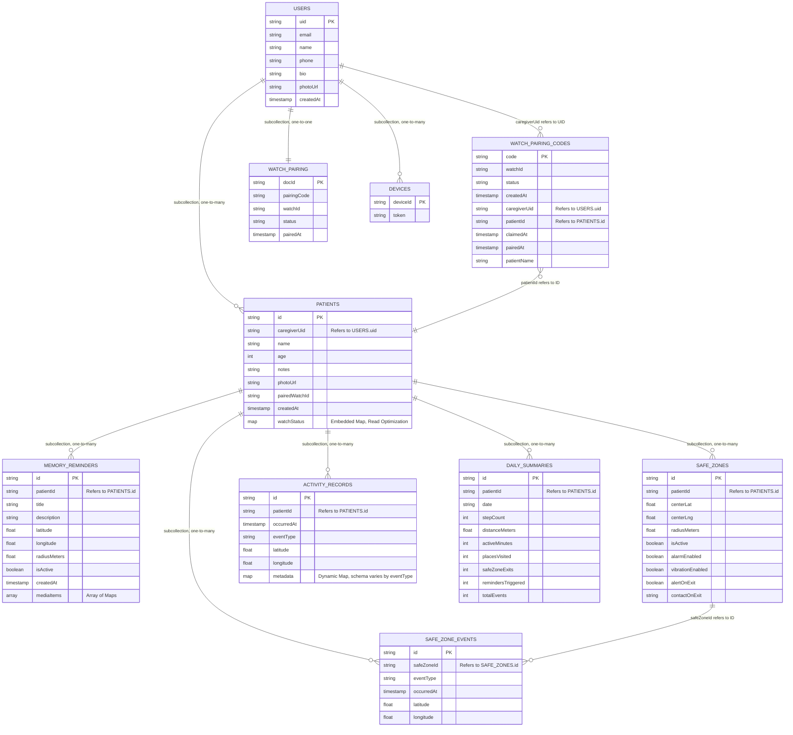

# Relapse Application — Firestore Data Dictionary

This document maps every Firestore collection, subcollection, and field used by the **Relapse** Flutter application. It is derived directly from the Dart model classes and remote data-source files in `lib/models/` and `lib/data/remote/`.

The architecture centers on a top-level `users` collection (the caregiver/account owner), with all patient data strictly nested beneath it as subcollections.

---

## Database Architecture Overview

```
/users/{uid}                                    ← Top-level caregiver document
    /watchPairing/current                       ← Single-doc subcollection (pairing state)
    /settings/{settingDoc}                      ← App preferences
    /devices/{deviceId}                         ← FCM push-notification tokens
    /patients/{patientId}                       ← Patient profile (with embedded watchStatus Map)
        /memoryReminders/{reminderId}           ← Geo-triggered memory reminders
        /safeZones/{safeZoneId}                 ← Geofenced boundary definitions
        /safeZoneEvents/{eventId}               ← Enter/exit crossing log
        /activityRecords/{recordId}             ← Chronological event log
        /dailySummaries/{summaryId}             ← Aggregated daily statistics

/watchPairingCodes/{code}                       ← Global handshake collection (watch ↔ mobile)
```

---

## Entity Relationship Diagram

The Relapse system is designed around the core relationship between the **Caregiver Profile** (`users` collection) and the **Patient Profile** (`patients` subcollection).

The system is fundamentally anchored by the **Patient ID**, which links all operational data back to the individual being monitored. This design allows one Caregiver to manage one or more Patients (a one-to-many relationship), with each Patient owned exclusively by a single Caregiver — making the Caregiver the root of the entire data hierarchy.

All operational data — the reason the system exists — is stored across five supporting subcollections, each maintaining a one-to-many relationship with the Patient Profile:

- **Memory Reminders** holds the geo-triggered cues configured by the caregiver, ensuring the patient receives context-aware memory prompts upon entering a location.
- **Safe Zones** stores the geographical boundaries that form the system's safety core.
- **Safe Zone Events** is the boundary-crossing log, recording every entry into and exit from a Safe Zone.
- **Activity Records** is the primary data stream, continuously logging location updates and system events for the patient as they occur.
- **Daily Summaries** provides pre-aggregated statistics, enabling the caregiver dashboard to display trends without expensive real-time re-computation.

Additionally, the `watchPairingCodes` root collection acts as a **shared handshake channel**, temporarily linking the WearOS watch hardware to both a Caregiver and a Patient during the device pairing process. The `watchStatus` Map is **embedded directly** inside the Patient document — a deliberate denormalization so the caregiver screen can read the patient's name, location, and watch status in a **single Firestore read** rather than across two separate documents.

> **Data Access Pattern Note:** The primary query driving the entire monitoring experience is *"Get all active safe zones and reminders for Patient X."* Nesting these as subcollections under the patient document means queries are automatically scoped to one patient and require no cross-collection joins.



---

## 1. Top-Level Collections

---

### Collection: `users`
**Path:** `/users/{uid}`
**Description:** Stores the primary caregiver's authentication state and public profile. The document ID is the Firebase Auth UID. The document merges `AppUser` auth fields with `CaregiverProfile` extended profile fields, written via `set(…, merge: true)`.

| Field Name | Data Type | Required? | Description | Notes / Validation |
| :--- | :--- | :--- | :--- | :--- |
| **Document ID** | String | Yes | The unique identifier for the caregiver document. | Must exactly match the UID generated by Firebase Authentication. |
| `uid` | String | Yes | Mirror of the document ID stored inside the document. | Matches Firebase Auth UID. Written on account creation. |
| `email` | String | Yes | The caregiver's registered email address. | Used for authentication and communications. Set by Firebase Auth. |
| `displayName` | String | No | Display name from the Firebase Auth provider (e.g., Google). | Set on first sign-in from Auth metadata. |
| `photoUrl` | String | No | URL to a profile picture from the Auth provider. | Typically points to Google profile photo. |
| `createdAt` | Timestamp | Yes | The exact date and time the account was first registered. | Stored as a Firestore `Timestamp`; converted from `DateTime` via `Timestamp.fromDate()`. |
| `name` | String | Yes | The caregiver's full name as entered in the app profile. | From `CaregiverProfile`. Maximum recommended length: 100 characters. |
| `phone` | String | No | The caregiver's contact phone number. | From `CaregiverProfile`. No strict format enforced. |
| `bio` | String | No | A short personal description or note about the caregiver. | From `CaregiverProfile`. |

---

### Collection: `watchPairingCodes`
**Path:** `/watchPairingCodes/{code}`
**Description:** A temporary, globally-accessible collection used for the Bluetooth-free handshake between the WearOS watch app and the mobile app. The watch creates the document; the mobile app claims it. Documents in this collection are short-lived and may be deleted after pairing is complete.

| Field Name | Data Type | Required? | Description | Notes / Validation |
| :--- | :--- | :--- | :--- | :--- |
| **Document ID** | String | Yes | The generated pairing code (e.g., `"ABC123"`). | Created by the WearOS watch app. Short, human-readable. |
| `watchId` | String | Yes | The hardware identifier of the watch requesting pairing. | Written by the watch on document creation. |
| `status` | String | Yes | The current lifecycle state of the pairing handshake. | Allowed values: `"pending"`, `"claimed"`, `"paired"`, `"unpaired"`. Starts as `"pending"`. |
| `createdAt` | Timestamp | Yes | The time the watch created the pairing entry. | Written by the **WearOS watch app** using `Timestamp.now()` during `createPairingEntry()`. |
| `caregiverUid` | String | No | The UID of the caregiver who claimed the code. | Added by the mobile app during the claiming phase. |
| `claimedAt` | Timestamp | No | The time the caregiver claimed the code. | Set using `FieldValue.serverTimestamp()` to prevent clock skew. |
| `pairedAt` | Timestamp | No | The time the pairing was fully finalized. | Set using `FieldValue.serverTimestamp()` during `finalizePairing()`. |
| `patientName` | String | No | The full name of the patient assigned to this watch. | Written by the mobile app after the caregiver completes patient profile setup. |
| `patientId` | String | No | The Firestore document ID of the assigned patient. | Written by the mobile app. Logical reference to `/users/{uid}/patients/{patientId}`. |

---

## 2. User Subcollections (Under `/users/{uid}`)

---

### Subcollection: `watchPairing`
**Path:** `/users/{uid}/watchPairing/current`
**Description:** Stores the caregiver's persistent local copy of the watch pairing state. This subcollection always contains exactly **one** document with the static ID `"current"`. It is the mobile app's source of truth for pairing, while `watchPairingCodes` is the shared handshake channel.

| Field Name | Data Type | Required? | Description | Notes / Validation |
| :--- | :--- | :--- | :--- | :--- |
| **Document ID** | String | Yes | Always the static string `"current"`. | Only one document ever exists in this subcollection. |
| `pairingCode` | String | Yes | The pairing code that was used for this pairing session. | Set to an empty string `""` when the watch is unpaired. |
| `watchId` | String | No | The hardware ID of the paired WearOS watch. | Set to `null` when unpaired. |
| `status` | String | Yes | The pairing state from the mobile app's perspective. | Allowed values: `"pending"`, `"paired"`, `"unpaired"`. Mirrors the `PairingStatus` enum. |
| `pairedAt` | Timestamp | No | The timestamp when pairing was fully finalized. | Set to `null` when unpaired. Uses `FieldValue.serverTimestamp()`. |

---

### Subcollection: `settings`
**Path:** `/users/{uid}/settings/{settingDoc}`
**Description:** Stores app-wide preferences for the caregiver. The structure of individual setting documents (e.g., notification preferences, theme) is determined by application logic and may contain `Boolean` flags or `Map` objects for grouped settings.

*(Specific document schemas are determined by app settings implementation and may include keys such as `theme`, `pushNotificationsEnabled`, etc.)*

---

### Subcollection: `devices`
**Path:** `/users/{uid}/devices/{deviceId}`
**Description:** Stores FCM (Firebase Cloud Messaging) device tokens to enable targeted push notifications to the caregiver's registered device(s).

| Field Name | Data Type | Required? | Description | Notes / Validation |
| :--- | :--- | :--- | :--- | :--- |
| **Document ID** | String | Yes | A hardware or app-generated device identifier. | Used to uniquely identify each device. |
| `token` | String | Yes | The FCM registration token for the device. | Must be kept up to date. Rotates periodically by Firebase. Used for targeted push notifications. |

---

## 5. WearOS Watch App — Firestore Access Map

The **Relapse-Watch** (WearOS/Android) app does **not** define its own separate Firestore collections. It operates entirely within the same shared database schema as the Flutter mobile app. The table below documents exactly which collections the watch reads from vs. writes to, and what it does with each.

| Collection / Path | Watch Reads? | Watch Writes? | What the Watch Does |
| :--- | :---: | :---: | :--- |
| `/watchPairingCodes/{code}` | Yes | Yes | **Writes** the initial `{ watchId, status: "pending", createdAt }` document to begin pairing. **Reads/streams** the document to detect when the mobile app sets `status` to `"claimed"`, `"paired"`, or `"unpaired"`. Deletes the document after successful pairing or on unpair. |
| `/users/{uid}/watchPairing/current` | Yes | Yes | **Streams** the `status` field to detect phone-initiated unpair. **Writes** `{ status: "unpaired" }` back to this document when the user initiates unpair from the watch side. |
| `/users/{uid}/patients/{patientId}` | Yes | Yes | **Streams** the full patient document to receive real-time name/age/notes edits made on the phone. **Writes** the embedded `watchStatus` Map field (including `isConnected`, `batteryLevel`, `lastSyncTimestamp`, `watchId`) during the periodic sync heartbeat. Also reads `settings.reminderCooldownMinutes` from this document. |
| `/users/{uid}/patients/{patientId}/safeZones` | Yes | No | **Queries and streams** documents where `isActive == true` to configure the on-device geofence engine. The watch is a **read-only consumer** of safe zone configuration. |
| `/users/{uid}/patients/{patientId}/memoryReminders` | Yes | No | **Queries and streams** documents where `isActive == true` to populate the watch's local Room database with geo-reminders. The watch extracts `latitude`, `longitude`, `radiusMeters`, `title`, `description`, and parses `mediaItems[].cloudUrl` per type into flat `imageUrl`/`audioUrl`/`videoUrl` fields for local caching. Read-only. |
| `/users/{uid}/patients/{patientId}/activityRecords` | No | Yes | **Writes** new records using batched Firestore writes (max 500 per batch). Each record is built by `activityRecordToFirestoreMap()` and matches the `ActivityRecord` schema exactly. |
| `/users/{uid}/patients/{patientId}/safeZoneEvents` | No | Yes | **Writes** new boundary-crossing events using batched Firestore writes. Each document matches the `SafeZoneEvent` schema. |
| `/users/{uid}/patients/{patientId}/dailySummaries` | No | Yes | **Writes** aggregated daily statistics using the date string (e.g., `"2025-04-23"`) as the document ID, with `SetOptions.merge()` so incremental updates do not overwrite existing data. |

### Watch-Specific Local State (Room Database — Not Firestore)

The watch app also maintains a **local Room (SQLite) database** for offline-first operation. This data is **never directly stored in Firestore** — it exists only on the device and is eventually synced up to Firestore by the `SyncService`.

| Local Table | Purpose | Synced to Firestore? |
| :--- | :--- | :--- |
| `geo_reminders` (`GeoReminderEntity`) | Caches active memory reminders pulled from Firestore. Stores `lastTriggeredAt` (epoch ms) locally to enforce cooldown periods without needing a round-trip to Firestore. | **Read from** Firestore on sync; `lastTriggeredAt` is device-only and never written back. |
| `activity_records` (pending uploads) | Buffers `ActivityRecord` entries locally until the `SyncService` can batch-upload them. The `uploaded: Boolean` flag tracks pending state. | **Written to** Firestore on sync via `uploadActivityRecords()`. |
| `safe_zone_events` (pending uploads) | Buffers `SafeZoneEvent` entries locally until upload. | **Written to** Firestore on sync via `uploadSafeZoneEvents()`. |
| `daily_summaries` (pending uploads) | Buffers `DailySummary` aggregations locally until upload. | **Written to** Firestore on sync via `uploadDailySummary()`. |

---

### Subcollection: `patients`
**Path:** `/users/{uid}/patients/{patientId}`
**Description:** Stores demographic, configuration, and real-time hardware telemetry for each patient being monitored by this caregiver. The `watchStatus` field is an embedded `Map` written directly by the WearOS watch app; all other fields are written by the mobile app.

| Field Name | Data Type | Required? | Description | Notes / Validation |
| :--- | :--- | :--- | :--- | :--- |
| **Document ID** | String | Yes | Auto-generated unique ID for the patient. | Created by Firestore `add()`. |
| `id` | String | Yes | Mirror of the patient document ID stored inside the document. | Populated after document creation and written back via `update()`. |
| `caregiverUid` | String | Yes | Logical reference to the parent caregiver. | Matches the `uid` of the parent `/users/{uid}` document. |
| `name` | String | Yes | The patient's full name. | |
| `age` | Number (Integer) | No | The patient's age in years. | Must be a positive integer if provided. |
| `notes` | String | No | Medical or general notes about the patient's condition. | |
| `photoUrl` | String | No | URL to the patient's photo. | Typically points to Firebase Cloud Storage. |
| `pairedWatchId` | String | No | The hardware ID of the WearOS watch paired to this patient. | Matches `watchId` in `watchPairingCodes` and `watchStatus`. Set to `null` if no watch is paired. |
| `createdAt` | Timestamp | Yes | The date and time the patient profile was first created. | Stored as a Firestore `Timestamp`. |
| `watchStatus` | Map | No | Embedded object containing real-time watch telemetry. Written by the WearOS watch app. | See nested `watchStatus` field breakdown below. |

**Nested Map: `watchStatus`**

| Field Name | Data Type | Required? | Description | Notes / Validation |
| :--- | :--- | :--- | :--- | :--- |
| `watchStatus.watchId` | String | Yes | The hardware ID of the watch that wrote this status update. | Must match `pairedWatchId` on the parent document. |
| `watchStatus.isConnected` | Boolean | Yes | Whether the watch is currently online and reachable. | **Defaults to `false`**. Written by the watch; read by the mobile app for UI status indicators. |
| `watchStatus.batteryLevel` | Number (Integer) | No | Current battery charge of the watch as a percentage. | Value between `0` and `100`. |
| `watchStatus.lastSyncTimestamp` | Timestamp | No | The last time the watch successfully wrote data to Firestore. | Used to detect stale watch connections. |
| `watchStatus.firmwareVersion` | String | No | The WearOS app version running on the watch. | Example: `"1.0.2"`. |

---

## 3. Patient Subcollections (Under `/users/{uid}/patients/{patientId}`)

---

### Subcollection: `memoryReminders`
**Path:** `/users/{uid}/patients/{patientId}/memoryReminders/{reminderId}`
**Description:** Stores geospatial memory reminders assigned to the patient. When the patient's watch detects they are within `radiusMeters` of the reminder's coordinates, the reminder is triggered and its `mediaItems` are presented on the watch.

| Field Name | Data Type | Required? | Description | Notes / Validation |
| :--- | :--- | :--- | :--- | :--- |
| **Document ID** | String | Yes | Unique ID for the reminder. | Auto-generated by Firestore. |
| `id` | String | Yes | Mirror of the reminder document ID stored inside the document. | |
| `patientId` | String | Yes | Logical reference to the parent patient. | Matches the parent `/patients/{patientId}` document ID. |
| `title` | String | Yes | The short, descriptive title of the memory reminder. | Displayed on the watch and caregiver app. |
| `description` | String | No | Detailed instructions or memories associated with this reminder. | Displayed as supplemental text when the reminder fires. |
| `latitude` | Number (Float) | No | The latitude coordinate that defines the reminder's trigger location. | Required for geo-triggering to be active. Stored as a 64-bit double. |
| `longitude` | Number (Float) | No | The longitude coordinate that defines the reminder's trigger location. | Required for geo-triggering to be active. Stored as a 64-bit double. |
| `radiusMeters` | Number (Float) | Yes | The radius (in meters) around the coordinates that triggers the reminder. | **Defaults to `100`**. Must be greater than 0. |
| `isActive` | Boolean | Yes | Whether the system is currently monitoring this reminder for triggering. | **Defaults to `true`**. Set to `false` to disable without deleting. |
| `createdAt` | Timestamp | Yes | The date and time the reminder was first created. | Stored as a Firestore `Timestamp`. |
| `mediaItems` | Array of Maps | Yes | A list of media attachments (photos, audio, video) shown when the reminder triggers. | **Defaults to `[]`** (empty array). Each element follows the `MediaItem` structure below. |

**Nested Map structure within `mediaItems` Array:**

| Field Name | Data Type | Required? | Description | Notes / Validation |
| :--- | :--- | :--- | :--- | :--- |
| `mediaItems[].id` | String | Yes | Unique identifier for the individual media item. | |
| `mediaItems[].reminderId` | String | Yes | Logical back-reference to the parent reminder. | Matches the parent `reminderId` document ID. |
| `mediaItems[].type` | String | Yes | The media format of this attachment. | Allowed values: `"photo"`, `"audio"`, `"video"`. Matches the `MediaType` enum. |
| `mediaItems[].localPath` | String | No | Absolute file path to the media on the caregiver's local device. | Only present if the media was recorded locally and not yet uploaded. |
| `mediaItems[].cloudUrl` | String | No | Firebase Storage download URL for the full-resolution media file. | Present after a successful upload. Used by the watch to fetch media. |
| `mediaItems[].thumbnailUrl` | String | No | Firebase Storage download URL for a smaller preview thumbnail. | Only applicable for `"photo"` and `"video"` types. |

---

### Subcollection: `safeZones`
**Path:** `/users/{uid}/patients/{patientId}/safeZones/{safeZoneId}`
**Description:** Defines named circular geofenced boundaries for the patient. The WearOS watch continuously monitors the patient's GPS location against all active safe zones. Exiting a boundary triggers configurable alert actions.

| Field Name | Data Type | Required? | Description | Notes / Validation |
| :--- | :--- | :--- | :--- | :--- |
| **Document ID** | String | Yes | Unique ID for the safe zone. | Auto-generated by Firestore. |
| `id` | String | Yes | Mirror of the safe zone document ID stored inside the document. | |
| `patientId` | String | Yes | Logical reference to the parent patient. | Matches the parent `/patients/{patientId}` document ID. |
| `centerLat` | Number (Float) | Yes | Latitude of the geographical center of the safe zone. | Stored as a 64-bit double. |
| `centerLng` | Number (Float) | Yes | Longitude of the geographical center of the safe zone. | Stored as a 64-bit double. |
| `radiusMeters` | Number (Float) | Yes | The radius (in meters) defining the boundary of the safe zone. | Must be greater than 0. |
| `isActive` | Boolean | Yes | Whether the watch is actively monitoring this zone. | **Defaults to `true`**. Set to `false` to pause monitoring without deleting. |
| `alarmEnabled` | Boolean | Yes | Whether an audible alarm plays on the watch when the patient exits this zone. | **Defaults to `true`**. |
| `vibrationEnabled` | Boolean | Yes | Whether the watch vibrates when the patient exits this zone. | **Defaults to `true`**. |
| `alertOnExit` | Boolean | Yes | Whether a push notification is sent to the caregiver's phone when the patient exits. | **Defaults to `true`**. |
| `contactOnExit` | String | No | A specific phone number to call or notify when the patient exits this zone. | Optional emergency contact override. No strict format enforced. |

---

### Subcollection: `safeZoneEvents`
**Path:** `/users/{uid}/patients/{patientId}/safeZoneEvents/{eventId}`
**Description:** An immutable log of individual safe zone boundary crossing events (enter and exit). Each document records a single crossing, its type, timestamp, and the patient's GPS coordinates at the moment of crossing.

| Field Name | Data Type | Required? | Description | Notes / Validation |
| :--- | :--- | :--- | :--- | :--- |
| **Document ID** | String | Yes | Unique ID for the event. | Auto-generated by Firestore. |
| `id` | String | Yes | Mirror of the event document ID. | |
| `safeZoneId` | String | Yes | Logical reference to the specific Safe Zone that was crossed. | References the document ID in `/patients/{patientId}/safeZones/{safeZoneId}`. |
| `eventType` | String | Yes | The type of boundary crossing that occurred. | Allowed values: `"enter"` or `"exit"`. Matches the `SafeZoneEventType` enum (via `.name`). |
| `timestamp` | Timestamp | Yes | The exact time the boundary crossing was detected. | Stored as a Firestore `Timestamp`. |
| `latitude` | Number (Float) | No | The patient's latitude at the moment of the crossing event. | Stored as a 64-bit double. |
| `longitude` | Number (Float) | No | The patient's longitude at the moment of the crossing event. | Stored as a 64-bit double. |

---

### Subcollection: `activityRecords`
**Path:** `/users/{uid}/patients/{patientId}/activityRecords/{recordId}`
**Description:** A chronological, append-only log of all significant system events for the patient. This is the primary audit trail used by the caregiver's activity history screen. Events include location updates, safe zone crossings, reminder triggers, and watch connectivity changes.

| Field Name | Data Type | Required? | Description | Notes / Validation |
| :--- | :--- | :--- | :--- | :--- |
| **Document ID** | String | Yes | Unique ID for the activity record. | Auto-generated by Firestore. |
| `id` | String | Yes | Mirror of the activity record document ID. | |
| `patientId` | String | Yes | Logical reference to the parent patient. | Matches the parent `/patients/{patientId}` document ID. |
| `timestamp` | Timestamp | Yes | The exact time the event occurred. | Stored as a Firestore `Timestamp`. Primary sort key for queries. |
| `eventType` | String | Yes | The specific category of the logged event. | Allowed values: `"location_update"`, `"safe_zone_enter"`, `"safe_zone_exit"`, `"reminder_triggered"`, `"watch_disconnected"`, `"watch_reconnected"`. Matches `ActivityEventType` enum via `.firestoreValue`. |
| `latitude` | Number (Float) | No | The patient's latitude when the event occurred. | Present for location-based events. Stored as a 64-bit double. |
| `longitude` | Number (Float) | No | The patient's longitude when the event occurred. | Present for location-based events. Stored as a 64-bit double. |
| `metadata` | Map | No | A dynamic payload carrying event-specific context. | Schema varies by `eventType`. May contain keys like `safeZoneId`, `reminderId`, or `description`. Can accept a raw JSON string or a `Map<String, dynamic>` from the watch. |

---

### Subcollection: `dailySummaries`
**Path:** `/users/{uid}/patients/{patientId}/dailySummaries/{summaryId}`
**Description:** Stores pre-aggregated daily statistics for the patient's health and app interactions. These are intended for dashboard display and trend analysis, computed either by a Cloud Function or incrementally by the watch/mobile app.

| Field Name | Data Type | Required? | Description | Notes / Validation |
| :--- | :--- | :--- | :--- | :--- |
| **Document ID** | String | Yes | Unique ID for the daily summary document. | Auto-generated or set to the date string (e.g., `"2025-04-23"`). |
| `id` | String | Yes | Mirror of the summary document ID. | |
| `patientId` | String | Yes | Logical reference to the parent patient. | Matches the parent `/patients/{patientId}` document ID. |
| `date` | String | Yes | The calendar date this summary covers. | Format: `"YYYY-MM-DD"`. Used as the primary lookup key. |
| `stepCount` | Number (Integer) | Yes | Total steps taken by the patient during the day. | **Defaults to `0`**. Must be ≥ 0. |
| `distanceMeters` | Number (Float) | Yes | Total physical distance (in meters) covered by the patient. | **Defaults to `0`**. Must be ≥ 0. |
| `activeMinutes` | Number (Integer) | Yes | Total minutes the patient was detected as physically active. | **Defaults to `0`**. Must be ≥ 0. |
| `placesVisited` | Number (Integer) | Yes | Number of distinct locations or zones the patient visited. | **Defaults to `0`**. Must be ≥ 0. |
| `safeZoneExits` | Number (Integer) | Yes | Total number of times the patient exited a designated safe zone. | **Defaults to `0`**. Must be ≥ 0. |
| `remindersTriggered` | Number (Integer) | Yes | Total number of memory reminders successfully delivered to the watch. | **Defaults to `0`**. Must be ≥ 0. |
| `totalEvents` | Number (Integer) | Yes | Total count of all logged activity events for the day across all types. | **Defaults to `0`**. Sum of all event types in `activityRecords` for this date. |

---

## 4. Relationship Map

The following table summarizes the logical foreign-key relationships between collections (NoSQL has no enforced FK constraints; these are application-level conventions).

| Source Field | Source Path | References | Target Path |
| :--- | :--- | :--- | :--- |
| `caregiverUid` | `/users/{uid}/patients/{patientId}` | Parent caregiver | `/users/{uid}` |
| `patientId` | `/…/memoryReminders/{reminderId}` | Parent patient | `/users/{uid}/patients/{patientId}` |
| `patientId` | `/…/safeZones/{safeZoneId}` | Parent patient | `/users/{uid}/patients/{patientId}` |
| `patientId` | `/…/safeZoneEvents/{eventId}` (implicit via path) | Parent patient | `/users/{uid}/patients/{patientId}` |
| `patientId` | `/…/activityRecords/{recordId}` | Parent patient | `/users/{uid}/patients/{patientId}` |
| `patientId` | `/…/dailySummaries/{summaryId}` | Parent patient | `/users/{uid}/patients/{patientId}` |
| `safeZoneId` | `/…/safeZoneEvents/{eventId}` | Safe zone that was crossed | `/users/{uid}/patients/{patientId}/safeZones/{safeZoneId}` |
| `mediaItems[].reminderId` | Embedded in `memoryReminders` document | Parent reminder | `/users/{uid}/patients/{patientId}/memoryReminders/{reminderId}` |
| `watchStatus.watchId` | Embedded `Map` in `/patients/{patientId}` | Watch pairing | `/watchPairingCodes/{code}` (via `watchId`) |
| `patientId` | `/watchPairingCodes/{code}` | Assigned patient | `/users/{uid}/patients/{patientId}` |
| `caregiverUid` | `/watchPairingCodes/{code}` | Caregiver who claimed the code | `/users/{uid}` |
| `token` | `/users/{uid}/devices/{deviceId}` | FCM push target | Firebase Cloud Messaging service |
